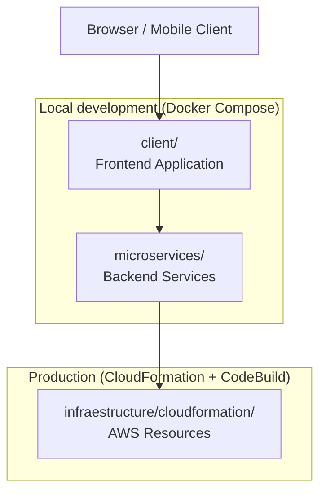

Lightpress is organized as a three-tier system: a user-facing frontend client, a backend composed of independent microservices, and cloud infrastructure provisioned declaratively on AWS. Each tier is contained in its own top-level directory and can be developed, tested, and deployed without coupling to the other tiers. Docker Compose bridges all three tiers locally; CloudFormation and CodeBuild take over in production.

## System overview



## The three tiers

<CardGroup cols={3}>
  <Card title="Frontend client" icon="display" href="/features/client">
    The `client/` directory holds the user-facing web application. It communicates with the microservices tier exclusively through HTTP APIs, keeping the UI layer decoupled from business logic.
  </Card>
  <Card title="Microservices" icon="cubes" href="/features/microservices">
    The `microservices/` directory contains independently deployable backend services. Each service owns its own data store, exposes a well-defined API, and can be scaled or replaced without affecting other services.
  </Card>
  <Card title="AWS infrastructure" icon="cloud" href="/features/infrastructure">
    The `infraestructure/cloudformation/` directory holds CloudFormation templates that provision every AWS resource the platform needs — VPCs, ECS clusters, RDS instances, S3 buckets, IAM roles, and more.
  </Card>
</CardGroup>

## Directory structure

```
Lightpress/
├── client/                        # Frontend application
├── microservices/                 # Backend service directories
├── infraestructure/
│   └── cloudformation/            # AWS CloudFormation templates
├── scripts/
│   ├── bash/                      # Shell automation scripts
│   └── python/                    # Python automation scripts
├── docker-compose.yml             # Local development orchestration
├── buildspec.yml                  # AWS CodeBuild pipeline definition
└── .env                           # Local environment variables (git-ignored)
```

## How services communicate

Within the local Docker Compose network, the frontend client and microservices share a private bridge network. The client sends HTTP requests to each microservice using its Docker Compose service name as the hostname — no external DNS or load balancer is required during development.

In production on AWS, service discovery shifts to AWS-native mechanisms. An Application Load Balancer (ALB) sits in front of the microservices tier, routing requests by path prefix or hostname to the appropriate ECS task. The frontend client is served from a CDN (such as CloudFront backed by S3) and makes API calls through the ALB's public endpoint.

<Tabs>
  <Tab title="Local (Docker Compose)">
    ```
    Browser
      → client container (port 3000)
        → microservice-a container (internal DNS: microservice-a:8001)
        → microservice-b container (internal DNS: microservice-b:8002)
    ```

    Services reference each other by their Docker Compose service names. No public network exposure is needed for inter-service communication.
  </Tab>
  <Tab title="Production (AWS)">
    ```
    Browser
      → CloudFront (CDN) → S3 (static client assets)
      → ALB (public endpoint)
          → ECS task: microservice-a
          → ECS task: microservice-b
    ```

    Each microservice runs as an ECS Fargate task. The ALB routes to target groups defined in the CloudFormation templates.
  </Tab>
</Tabs>

## Local development vs production

Docker Compose and CloudFormation serve the same purpose at different scopes: both describe the desired state of the system, and both are declarative. The key differences are in their execution environment and lifecycle.

| Concern | Docker Compose (local) | CloudFormation (production) |
|---|---|---|
| Scope | Single developer machine | AWS account and region |
| Runtime | Docker Engine | ECS Fargate, Lambda, RDS, etc. |
| State management | Container process lifecycle | AWS CloudFormation stacks |
| Secrets | `.env` file (git-ignored) | AWS Secrets Manager / SSM |
| Networking | Docker bridge network | VPC, subnets, security groups |
| Scaling | Manual (`--scale` flag) | Auto Scaling groups, ECS desired count |

<Note>
  The `buildspec.yml` in the project root is the AWS CodeBuild build specification. It defines the steps CodeBuild runs when a push triggers the CI/CD pipeline: installing dependencies, running tests, building container images, pushing to Amazon ECR, and initiating a CloudFormation stack update.
</Note>

## CI/CD pipeline

Lightpress uses AWS CodeBuild as its CI/CD engine. A push to the main branch triggers a build that runs the `buildspec.yml` instructions. At a high level the pipeline:

1. Installs Node.js and Python dependencies for all services
2. Runs the test suite for each microservice
3. Builds Docker images for the client and each microservice
4. Pushes images to Amazon Elastic Container Registry (ECR)
5. Updates the CloudFormation stack to deploy the new image versions to ECS

<Tip>
  The `scripts/bash/` and `scripts/python/` directories contain helper scripts that the `buildspec.yml` calls during pipeline steps. Keeping these scripts separate from the build specification makes them easier to run locally for debugging.
</Tip>

## Explore further

<CardGroup cols={2}>
  <Card title="Deployment overview" icon="cloud-arrow-up" href="/deployment/overview">
    Step-by-step instructions for deploying Lightpress to AWS for the first time.
  </Card>
  <Card title="CloudFormation templates" icon="file-code" href="/deployment/aws-cloudformation">
    Reference for the infrastructure templates in `infraestructure/cloudformation/`.
  </Card>
  <Card title="Docker Compose reference" icon="cube" href="/reference/docker-compose">
    Configuration reference for the `docker-compose.yml` file.
  </Card>
  <Card title="CI/CD pipeline" icon="arrows-rotate" href="/deployment/cicd">
    How CodeBuild, ECR, and ECS work together to ship new versions automatically.
  </Card>
</CardGroup>
