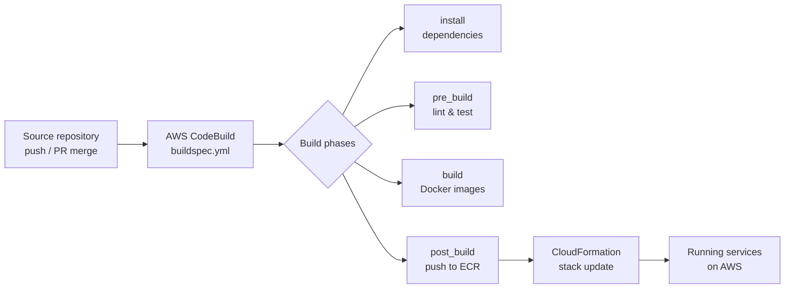

Lightpress supports two deployment paths that map to different stages of the development lifecycle. Locally, Docker Compose orchestrates all services on your machine so you can develop and test without touching AWS. In production, CloudFormation provisions your AWS infrastructure and CodeBuild automates the build and deployment pipeline. Both paths share the same codebase and configuration conventions, so promoting from local to production is straightforward.

## Prerequisites

Before deploying Lightpress in either environment, make sure you have the following tools installed and configured.

<Tabs>
  <Tab title="Local development">
    - **Docker Desktop** 4.x or later — required for Docker Compose
    - **Node.js** 18 LTS or later — for the `client/` frontend
    - **Python 3.10+** — for scripts in `scripts/python/`
    - A `.env` file at the repository root (copy from `.env.example` and fill in your values)
  </Tab>
  <Tab title="AWS production">
    - **AWS CLI** v2, configured with credentials that have sufficient IAM permissions
    - **AWS account** with access to CloudFormation, CodeBuild, ECR, and the services your stacks provision
    - An S3 bucket for CloudFormation template storage and build artifacts
    - A source repository connected to AWS CodeBuild (GitHub, CodeCommit, or Bitbucket)
  </Tab>
</Tabs>

## Deployment paths

<CardGroup cols={2}>
  <Card title="Docker Compose" icon="cube" href="/deployment/docker">
    Run all Lightpress services locally with a single `docker compose up` command. Covers the Compose file structure, environment variables, log access, and image rebuilds.
  </Card>
  <Card title="AWS CloudFormation" icon="layer-group" href="/deployment/aws-cloudformation">
    Provision your production AWS infrastructure with repeatable CloudFormation stacks. Covers template structure, the deploy command, stack parameters, updates, and rollback.
  </Card>
  <Card title="CI/CD with CodeBuild" icon="arrows-rotate" href="/deployment/cicd">
    Automate builds and deployments with `buildspec.yml` and AWS CodeBuild. Covers build phases, source triggers, environment variables, and viewing build logs.
  </Card>
</CardGroup>

## Deployment pipeline flow

The production pipeline moves code from a source repository through CodeBuild and into AWS-managed infrastructure. The sequence below describes the end-to-end flow.

## Environment variable conventions

Lightpress uses `.env` files for local development. The `.gitignore` excludes `.env` from version control — never commit secrets to the repository. In production, pass environment variables through AWS CodeBuild environment variables or AWS Systems Manager Parameter Store and reference them from your CloudFormation templates.

<Warning>
  Do not commit `.env` files or any file containing secrets. Use AWS Secrets Manager or SSM Parameter Store for production credentials.
</Warning>

## Repository structure reference

The directories relevant to deployment are:

| Path | Purpose |
|---|---|
| `docker-compose.yml` | Defines all services for local Docker Compose development |
| `buildspec.yml` | AWS CodeBuild build specification |
| `infraestructure/cloudformation/` | CloudFormation templates for AWS resource provisioning |
| `scripts/bash/` | Shell scripts for operational and deployment tasks |
| `scripts/python/` | Python scripts for automation and data tasks |

<Note>
  The `infraestructure/` directory name follows the original repository spelling. Use this exact path in all CLI commands and CloudFormation references.
</Note>
