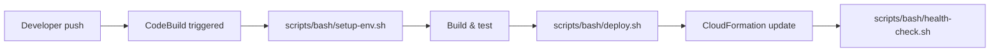

Lightpress ships with a `scripts/` directory that holds the automation glue between your application code and your AWS infrastructure. Rather than manually running ad-hoc commands, you encode operational tasks — deploying services, checking health, migrating data, generating reports — as versioned, repeatable scripts that anyone on the team can run.

## Directory structure

The `scripts/` directory is split by language so that the right tool is always in the right place:

```
scripts/
├── bash/
│   ├── deploy.sh          # CloudFormation deployment helper
│   ├── health-check.sh    # Service health polling
│   ├── setup-env.sh       # Local environment validation
│   ├── collect-logs.sh    # CloudWatch log collection
│   └── db-backup.sh       # Database backup and restore
└── python/
    ├── migrate.py          # Data migrations
    ├── report.py           # Usage and billing reports
    ├── integration_test.py # Post-deployment smoke tests
    ├── rotate-secrets.py   # Secrets Manager rotation
    └── requirements.txt    # Python dependencies
```

<Note>
  The `scripts/bash/` and `scripts/python/` directories exist in the repository as scaffolding. Scripts are added as your operational needs grow — start with the ones most relevant to your current stage.
</Note>

## Bash vs Python: when to use each

Choosing the right language for a script keeps your automation maintainable and avoids unnecessary dependencies.

<CardGroup cols={2}>
  <Card title="Bash" icon="terminal">
    Use Bash for tasks that are primarily shell orchestration: running CLI tools, setting environment variables, chaining AWS CLI commands, and wrapping Docker or `docker compose` operations. Bash is ideal when the logic is linear and the main work is delegating to other programs.
  </Card>
  <Card title="Python" icon="code">
    Use Python when the task involves data structures, AWS SDK calls via `boto3`, error handling logic, data transformation, or anything that would be unwieldy as a shell pipeline. Python scripts are also easier to unit-test and better suited for tasks that run as part of CI/CD.
  </Card>
</CardGroup>

A practical rule: if you find yourself writing more than a few lines of `awk` or `sed` to parse output, switch to Python.

## How scripts integrate with the deployment workflow

Lightpress uses AWS CodeBuild as its CI/CD engine. The `buildspec.yml` at the project root defines the build phases. Scripts in `scripts/` are invoked directly from `buildspec.yml` phases or as pre/post hooks to CloudFormation stack operations.



Scripts can also be run locally for day-to-day operations — log collection, database backups, and ad-hoc AWS queries — without needing to trigger a full pipeline run.

## Prerequisites

Before running any script, make sure the following are in place:

<Steps>
  <Step title="AWS CLI configured">
    Install the AWS CLI and configure credentials with sufficient IAM permissions for the operations your scripts perform.
    ```bash
    aws configure
    aws sts get-caller-identity
    ```
  </Step>
  <Step title="Docker and Docker Compose installed">
    Bash scripts that manage local services depend on Docker being available in your `PATH`.
    ```bash
    docker --version
    docker compose version
    ```
  </Step>
  <Step title="Python environment ready">
    Python scripts require Python 3.9 or later and a virtual environment with dependencies installed from `scripts/python/requirements.txt`. See the [Python scripts guide](/scripts/python) for setup details.
  </Step>
  <Step title="Environment variables set">
    Most scripts read configuration from environment variables. Copy `.env.example` to `.env` at the project root and populate the required values before running any script locally.
    ```bash
    cp .env.example .env
    ```
  </Step>
</Steps>

<Warning>
  Never commit your `.env` file. It is listed in `.gitignore` and contains secrets such as database credentials and AWS keys. Use AWS Secrets Manager or Parameter Store for secrets in production environments.
</Warning>

## Explore the scripts

<CardGroup cols={2}>
  <Card title="Bash scripts" icon="terminal" href="/scripts/bash">
    Deploy helpers, environment setup, health checks, log collection, and database backup and restore scripts for the AWS and Docker stack.
  </Card>
  <Card title="Python scripts" icon="code" href="/scripts/python">
    AWS SDK automation with `boto3`, data migration, reporting, and integration testing scripts with full setup instructions.
  </Card>
</CardGroup>
